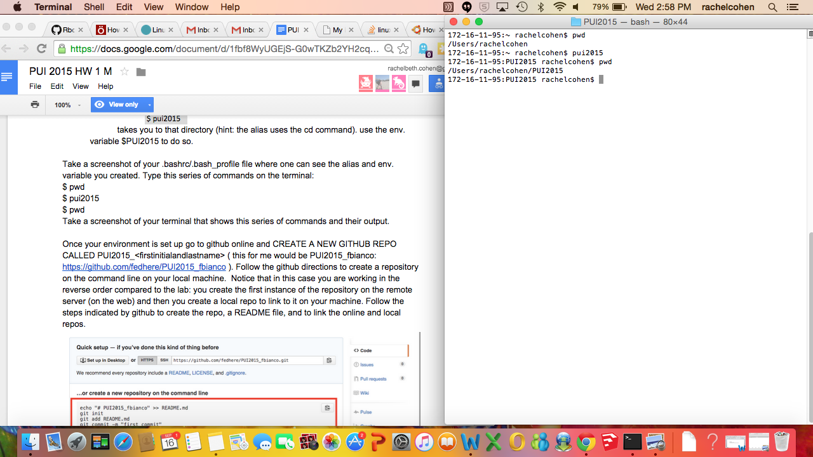
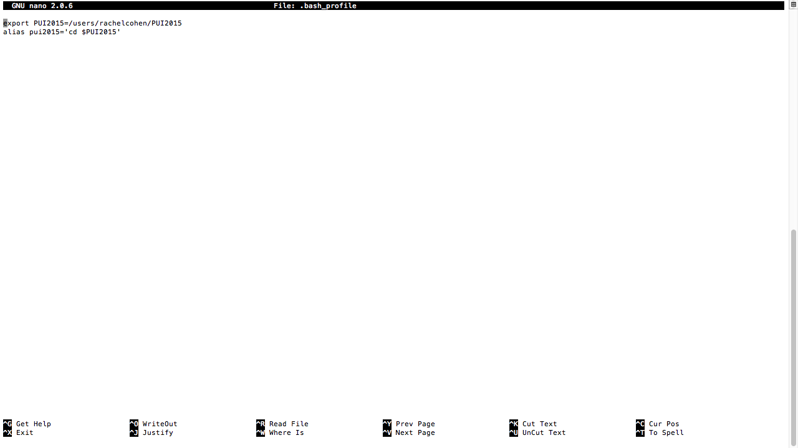

# PUI2015_rcohen

This file explains how I set up my environment. First I created an environmental variable so that PUI2015 stood for the full directory link. Then I created an alias so that typing pui2015 opened this folder directly, with the cd command embedded. Saving these commands to the bash profile makes the environment automatically apply on future use.

